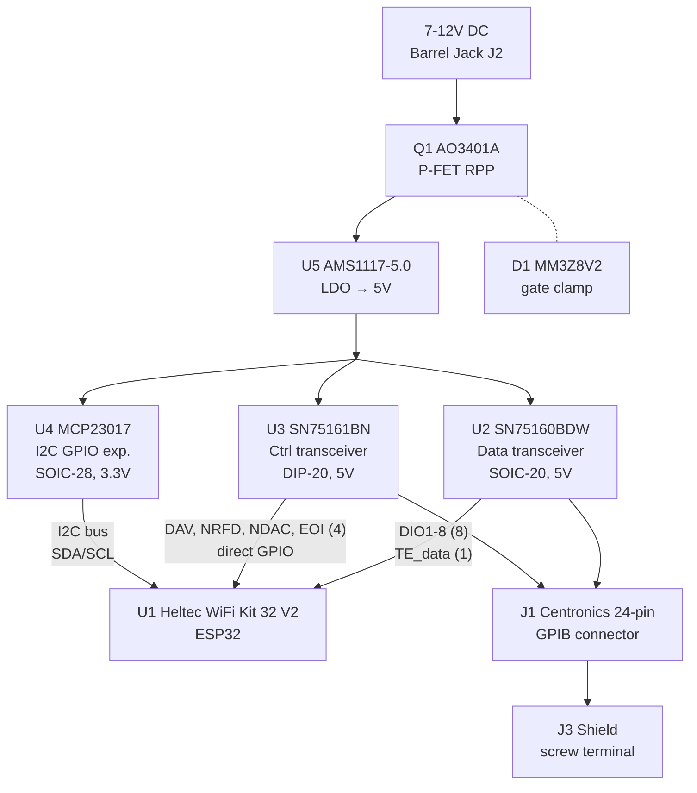

## Electrical architecture

### Block diagram

### GPIB bus transceivers

The GPIB bus requires 5V signaling. Two TI transceivers handle the voltage translation:

- **SN75160BDW** (U2) — 8-bit bidirectional data bus transceiver (DIO1-DIO8). The `~PE` pin is tied to VCC to disable 3-state mode. Direction is controlled by `TE_data` from ESP32 GPIO17.

- **SN75161BN** (U3) — Control bus transceiver handling DAV, NRFD, NDAC, EOI, ATN, IFC, SRQ, REN. Direction is controlled by `TE_ctrl` and `DC`, both from the MCP23017.

No level shifters are needed: ESP32 3.3V outputs exceed the SN7516x TTL input threshold (~1.5V VIH).

### External power with reverse polarity protection

The board can be powered from a 7-12V barrel jack (J2) or from USB via the ESP32 module's 5V pin.

The barrel jack path uses an **AO3401A P-channel MOSFET** (Q1, SOT-23) for reverse polarity protection:
- Source connected to barrel jack V+
- Drain connected to AMS1117-5.0 LDO input
- Gate pulled to GND via 100k resistor (R1)
- **D1 MM3Z8V2** Zener diode (SOD-323) clamps the gate-drain voltage for ESD/spike protection

Normal operation: Vgs = 0 - Vin << 0, FET is ON with millivolt drop (~2.4mV at 200mA). Reverse polarity: Vgs >= 0, FET is OFF, circuit protected.

The **AMS1117-5.0** (U5, SOT-223) regulates down to 5V. Capacitors: 10uF input (C1), 10uF output (C2), all 0603.

Another **AO3401A P-channel MOSFET** protects the AMS1117 against current flowing back into it when the board is powered by the ESP32 (via USB)

### I2C GPIO expander — why and how

The Heltec WiFi Kit 32 V2 only exposes 16 bidirectional GPIOs (the OLED uses GPIO4/15/16). GPIB requires 18+ signals. The **MCP23017** (U4, SOIC-28) adds 16 GPIOs via I2C, of which 6 are used for slow management signals.

**Critical design choice:** The MCP23017 is powered at **3.3V**, not 5V. This is because the ESP32 I2C lines output 3.3V, and the MCP23017 at 5V requires VIH = 0.7 x 5V = 3.5V — which 3.3V cannot reliably meet. At 3.3V, the MCP23017's outputs still drive the SN75161B TTL inputs correctly (VIH ~ 1.5V).

I2C address: 0x20 (A0=A1=A2=GND). RESET tied to VCC.

### Signal routing: fast path vs slow path

The signal split between direct GPIOs and the MCP23017 is deliberate:

| Path | Signals | Latency | Used during |
|------|---------|---------|-------------|
| **Direct GPIO** (fast) | DIO1-8, DAV, NRFD, NDAC, EOI, TE_data | ~0 ns | Every byte transfer |
| **MCP23017 I2C** (slow) | ATN, IFC, SRQ, REN, TE_ctrl, DC | ~100 us | Bus mode changes only |

**Timing-constrained signals (data + handshake) are never routed through the I2C expander.** The three-wire handshake (DAV/NRFD/NDAC) and data lines (DIO1-8) must respond within microseconds during transfers. ATN, IFC, SRQ, and REN only change during bus management operations (addressing, interface clear, service request) — millisecond-level latency is acceptable.

This hybrid architecture allows the TDS784A's fast GPIB transfers (200-500 KB/s) to run at full speed while fitting within the ESP32's limited GPIO count.

## Component summary

| Ref | Component | Package | Description |
|-----|-----------|---------|-------------|
| U1 | Heltec WiFi Kit 32 | 2x18 pin header | ESP32 MCU with OLED |
| U2 | SN75160BDW | SOIC-20W | GPIB data bus transceiver |
| U3 | SN75161BN | DIP-20 | GPIB control bus transceiver |
| U4 | MCP23017 | SOIC-28 | I2C GPIO expander |
| U5 | AMS1117-5.0 | SOT-223 | 5V LDO regulator |
| Q1 | AO3401A | SOT-23 | P-FET reverse polarity protection |
| Q2 | AO3401A | SOT-23 | P-FET backflow protection to AMS1117-5.0 |
| Q3 | MMBT55551L | SOT-23 | NPN power sensing |
| D1 | MM3Z8V2 | SOD-323 | 8.2V Zener gate clamp |
| J1 | Centronics 24-pin | Custom | GPIB connector |
| J2 | Barrel jack | Horizontal | 7-12V DC input |
| J3 | Screw terminal 1x2 | Phoenix PT-1.5 5mm | Shield connection |
| R1 | 100k | 0603 | Q1 gate pullup (makes it conductor) |
| R2 | 100k | 0603 | Q2 gate pulldown (makes it block) |
| R3 | 10k  | 0603 | Q3 power sensing base current limiter |
| C1 | 10uF | 0603 | LDO input cap |
| C2 | 10uF | 0603 | LDO output cap |
| C3,C4 | 100nF | 0603 | SN7516x decoupling |
| C5 | 100nF | 0603 | MCP23017 decoupling |
| C6,C7 | 22uF | 0603 | SN7516x bulk bypass |