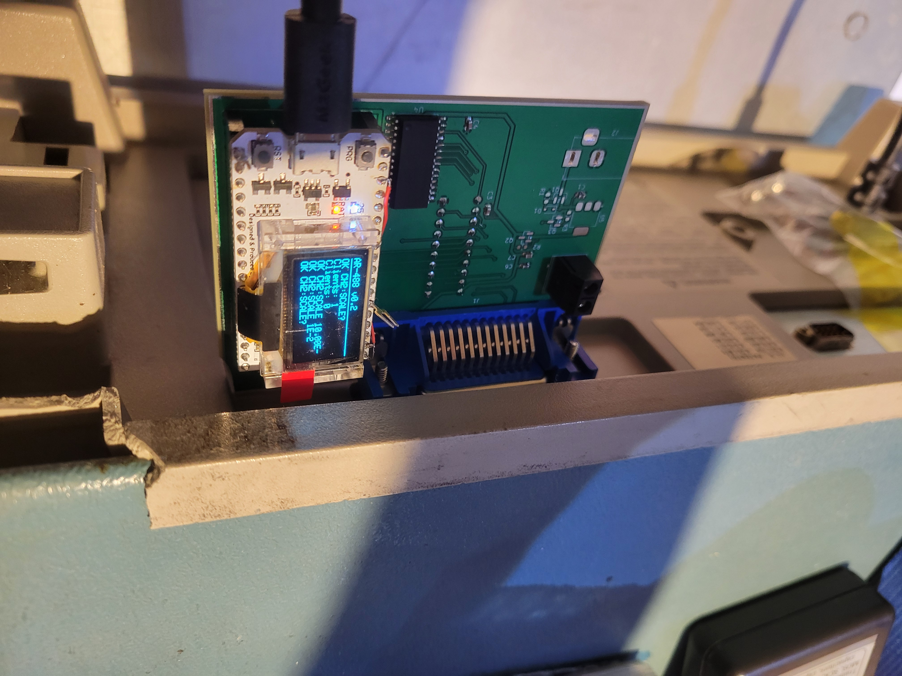
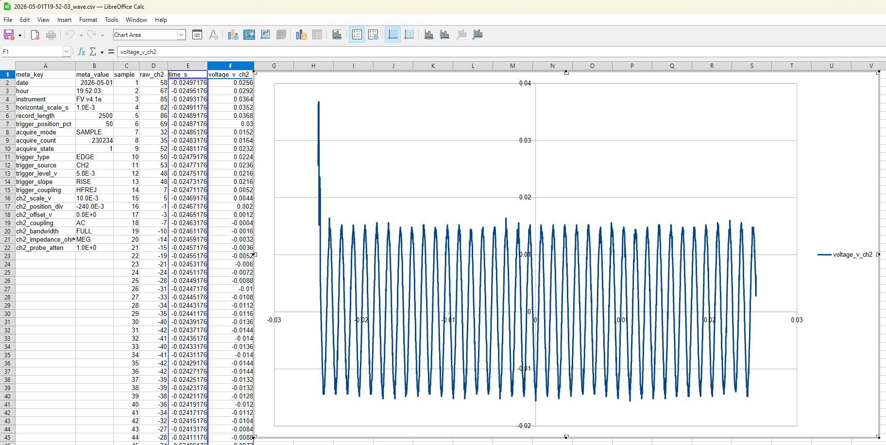
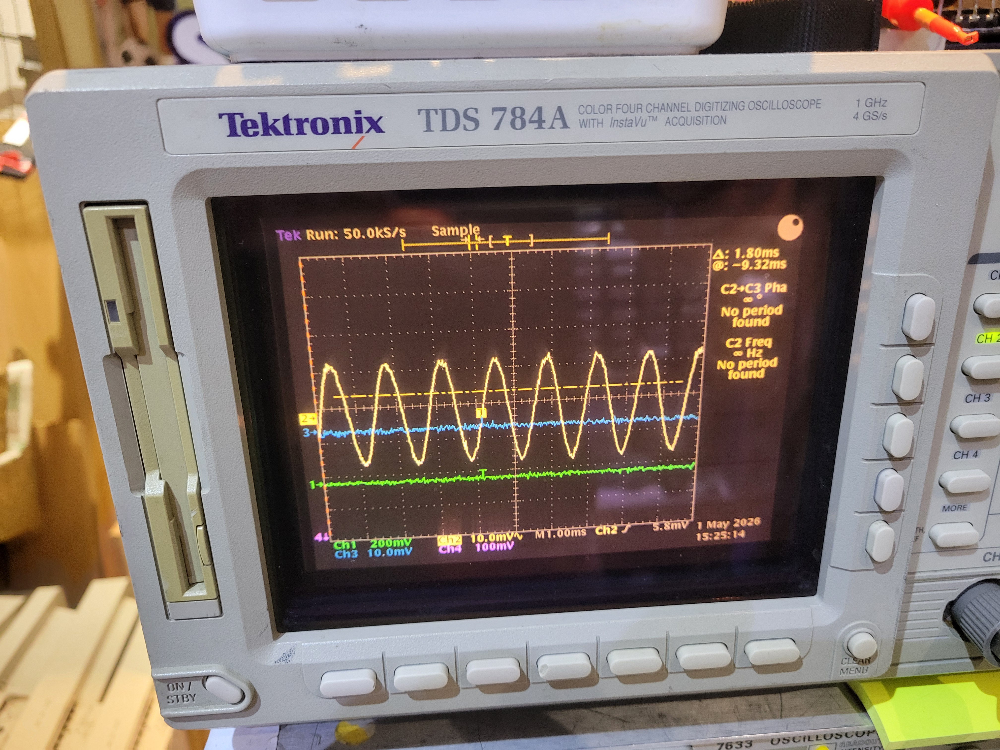

# AR-488-ESP32

GPIB/IEEE-488 interface board for the **Tektronix TDS784A** oscilloscope, based on an ESP32 (Heltec WiFi Kit 32) with GPIB bus transceivers. The board plugs directly onto the instrument's Centronics 24-pin GPIB connector.

This project is inspired by the [AR-488](https://github.com/Twilight-Logic/AR488) Arduino GPIB adapter, redesigned around the ESP32 for WiFi capability and higher throughput.



This is work in progress, however the PCB works, requiring some modifications:
* to supply 3.3V instead of 5.0 V to the MCP chip (because I used a V1 ESP32 board and I thought I had V2)
* add the I2C pullups
* remove 3mm from the left side to fit directly behind the TDS784
If you consider making it check the photos in the docs subdirectory. The gerber files I have used are in AR488_ESP32/Elecrow_manufacturing_v1.1.zip

The ESP32 USB can power the whole board, if you use it this way, no need to populate the barrel jack connector and power supply conditioning part (it has not been tested)

See file [IMPROVEMENTS_V2.md](IMPROVEMENTS_V2.md) for further improvements (which I may never implement myself)

## Design workflow and caveats

The PCB has been designed with circuit-synth and claude.

Circuit-synth required a modification to work under Windows and git-bash (see my circuit-synth repo). Another circuit-synth
anoyance is that circuit-synth used hierachical connectors on the same sheet, this was giving warnings in the kicad rules checker.

When refreshing the circuit with circuitsynth, it uses a set of new internal identifiers, so when updating the PCB from the electrical schematic (F8) you must check the option "Re-link footprint ... from reference designators"

See file [AI_Assisted_design_workflow.md](AI_Assisted_design_workflow.md)

## Electrical architecture and implementation

See file [Electrical_Architecture.md](Electrical_Architecture.md)

The ESP32 board used is the Heltec Wifi Kit 32 (version 1), the V2 has the same pinout and can be used directly, however the V3 has different I2C pins and most likely will require adjustments to schematic and firmware.

The exposed plated area around is meant for to solder a shield to limit radiated EMI in the lab. Not tested. Shielding completely will also shield the Wifi, so at this point this is a half baked idea.

## Firmware and Software

### Hardware test
In directory hardware_test, a test firmware is available, it sends a 1ms pulse to each of the GPIB connector pins.

### Firmware
The firmware for the ESP32 implements an HTTP API json style server made available on Wifi, not the usual serial protocol.

### Host software
In firmware/test the send_gpib.py allows to exercise many features and get back entire curve data, notably in .csv format, example commands:
```
# getting curve data
uv run --with websockets python firmware/test/send_gpib.py --waveform --points 5000 --out csv --name wave --source CH2 192.168.xx.yy
# getting a screen copy in .tif format
uv run --with websockets python firmware/test/send_gpib.py 192.168.11.175 --hardcopy
```
#### CSV example

#### Screen copy through GPIB and host software send_gpib.py

#### Actual screen for comparison



#### Host software help (-h)
```
send_gpib.py -h
usage: send_gpib.py [-h] [--addr ADDR] [--timeout TIMEOUT] [--binary] [--waveform] [--hardcopy]
                    [--hardcopy-format {TIFF,BMP,BMPCOLOR,PCX,PCXCOLOR,RLE}] [--hardcopy-layout {PORTRAIT,LANDSCAPE}]
                    [--hardcopy-palette {COLOR,MONOCHROME,INKSAVER,HARDCOPY}] [--points POINTS] [--start-index START_INDEX]
                    [--end-index END_INDEX] [--chunk-bytes CHUNK_BYTES] [--source SOURCE] [--width {1,2}] [--name NAME] [--out OUT]
                    host [command]

Send GPIB SCPI commands to a Tek scope via the AR-488-ESP32 gateway.

The ESP32 hosts a JSON-over-WebSocket bridge at ws://<host>/ws. This
script handles the protocol so an operator (or AI agent) can issue
SCPI commands and capture waveforms directly from the shell.

Invocation
----------
    send_gpib.py <ip> <scpi-command>           # auto: query if '?' else write
    send_gpib.py <ip> --binary "<scpi>"        # force binary response
    send_gpib.py <ip> --waveform [options]     # capture waveform(s)
    send_gpib.py <ip> --hardcopy [options]     # capture screen (TIFF default)
    send_gpib.py --help                         # full per-flag help

Output files
------------
Named  <ISO_8601>_<name>[_<chN>].<ext>  where:
  ISO_8601 = YYYY-MM-DDTHH-MM-SS taken at capture start (Windows-safe)
  name     = --name (default 'waveform')
  ext      = controlled by --out: 'csv', 'bin', or 'csv,bin'
  Default for --waveform is csv; other commands write nothing unless
  --out bin is given.

CSV layout
----------
    meta_key, meta_value, sample, raw_chN..., time_s, voltage_v_chN...
- Cols 1-2 hold scope state: date, hour, *IDN?, horizontal/trigger
  setup, then per-channel scale/offset/coupling/etc. Failed queries
  are silently dropped from this block.
- 'sample' is the 1-based scope record index.
- time_s/voltage_v_* are present only when WFMPRE? succeeds.

Windowed / large captures
-------------------------
TDS784A supports up to 500 000 points per record (option 1M). Use
--start-index/--end-index (1-based inclusive) to crop in the
instrument via DATA:START / DATA:STOP - only the requested range
crosses the GPIB bus. Windows larger than --chunk-bytes (default
32 KiB) are chunked transparently to fit the gateway's 64 KiB buffer.

Examples
--------
    send_gpib.py 192.168.1.42 "*IDN?"
    send_gpib.py 192.168.1.42 "CH2:SCALE 500E-3"             # 500 mV/div
    send_gpib.py 192.168.1.42 "HORIZONTAL:MAIN:SCALE?"

    # Default 5 K-pt capture from CH1 -> <stamp>_waveform.csv
    send_gpib.py 192.168.1.42 --waveform

    # Two channels, both CSV and per-channel .bin
    send_gpib.py 192.168.1.42 --waveform --source CH1,CH2 --out csv,bin

    # Full 500 K-pt record at 16-bit, custom name
    send_gpib.py 192.168.1.42 --waveform --points 500000 --width 2 --name run42

    # Sub-window 100k..105k from a 500 K record (5 K samples on the wire)
    send_gpib.py 192.168.1.42 --waveform --points 500000 \
                 --start-index 100000 --end-index 105000

    # Screen hardcopy as TIFF -> <stamp>_screen.tif
    send_gpib.py 192.168.1.42 --hardcopy

    # Hardcopy as BMP color, custom name
    send_gpib.py 192.168.1.42 --hardcopy --hardcopy-format BMPCOLOR --name run42

    # Different scope GPIB address
    send_gpib.py 192.168.1.42 --addr 5 "*IDN?"

positional arguments:
  host                  AR-488-ESP32 IP or hostname (shown on the OLED)
  command               SCPI command (omit when using --waveform)

options:
  -h, --help            show this help message and exit
  --addr ADDR           GPIB primary address (default 1)
  --timeout TIMEOUT     GPIB timeout in ms
  --binary              Force binary_query action (response returned as raw bytes)
  --waveform            Capture a waveform: configures DATA:* and runs CURVE? per channel
  --hardcopy            Capture the scope screen as an image (default TIFF). Saved to <stamp>_<name>.<ext>.
  --hardcopy-format {TIFF,BMP,BMPCOLOR,PCX,PCXCOLOR,RLE}
                        HARDCOPY:FORMAT value (default TIFF)
  --hardcopy-layout {PORTRAIT,LANDSCAPE}
                        HARDCOPY:LAYOUT value (default PORTRAIT)
  --hardcopy-palette {COLOR,MONOCHROME,INKSAVER,HARDCOPY}
                        HARDCOPY:PALETTE value (default COLOR)
  --points POINTS       Default end-index when --end-index is not given (default 5000). Set to the scope's full record length (up
                        to 500000) to grab everything.
  --start-index START_INDEX
                        First record sample to transfer, 1-based (default 1). Maps to DATA:START.
  --end-index END_INDEX
                        Last record sample to transfer, 1-based inclusive (default --points). Maps to DATA:STOP.
  --chunk-bytes CHUNK_BYTES
                        Max bytes per CURVE? response; larger windows are split into chunks transparently (default 32768; the
                        gateway caps at ~64KiB).
  --source SOURCE       Source channel(s), comma-separated (default CH1, e.g. CH1,CH2)
  --width {1,2}         Bytes per sample, 1 or 2 (default 1)
  --name NAME           Stem for output files (default 'waveform' for --waveform, 'screen' for --hardcopy, 'capture' otherwise)
  --out OUT             Output formats, comma-separated: csv, bin. Default for --waveform is 'csv'; for other commands no file is
                        written.
```

## License

MIT
