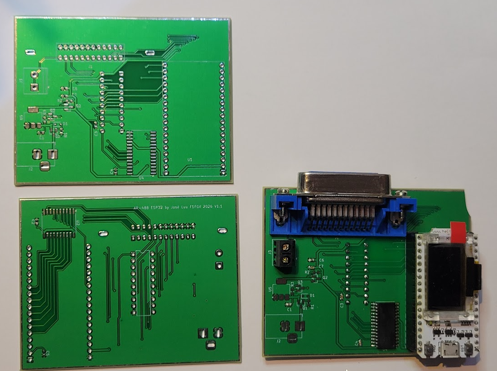
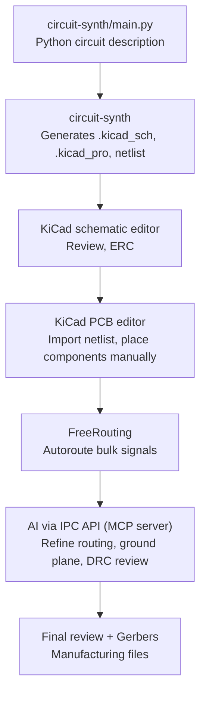
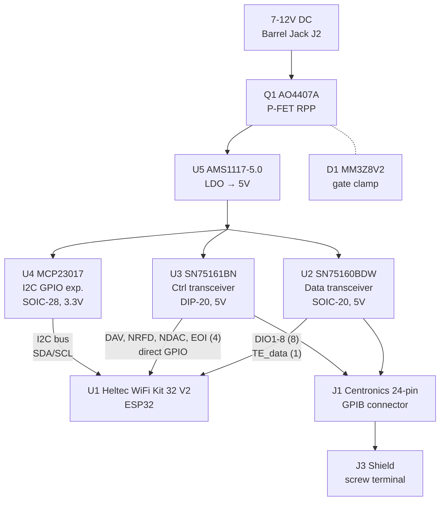

# AR-488-ESP32

GPIB/IEEE-488 interface board for the **Tektronix TDS784A** oscilloscope, based on an ESP32 (Heltec WiFi Kit 32 V2) with GPIB bus transceivers. The board plugs directly onto the instrument's Centronics 24-pin GPIB connector.

This project is inspired by the [AR-488](https://github.com/Twilight-Logic/AR488) Arduino GPIB adapter, redesigned around the ESP32 for WiFi capability and higher throughput.



## Design workflow

The schematic is written in Python using [circuit-synth](https://github.com/circuit-synth/circuit-synth), which generates KiCad 9/10 project files. The PCB layout is done in KiCad, assisted by AI through the IPC API.



### Generating the schematic

```bash
export KICAD_SYMBOL_DIR="C:/Program Files/KiCad/9.0/share/kicad/symbols;$(pwd)/libs"
export PYTHONIOENCODING=utf-8
uv run python circuit-synth/main.py
```

The generated KiCad project is in `AR488_ESP32/`.

## Development environment setup

### Prerequisites

- **OS:** Windows 11 under **Git Bash** (Unix shell syntax throughout)
- **Python:** 3.12 via [uv](https://github.com/astral-sh/uv)
- **KiCad:** 9.0 (or 10.0 — the IPC API is the same)
- **FreeRouting:** installed as KiCad plugin or [standalone](https://github.com/freerouting/freerouting)

### Installing circuit-synth

circuit-synth is included as a **git submodule** pointing to `joseluu/circuit-synth` on the `fix/windows-utf8-file-write` branch. This branch contains fixes for Windows UTF-8 encoding issues (emoji in logs, missing `encoding="utf-8"` on `write_text()` calls) that are not yet merged upstream.

```bash
# Clone with submodule
git clone --recurse-submodules <this-repo-url>
cd AR-488-ESP32

# Or if already cloned without submodules
git submodule update --init

# Create the virtual environment and install circuit-synth in editable mode
uv sync
```

The `pyproject.toml` references circuit-synth as a local editable dependency:

```toml
[tool.uv.sources]
circuit-synth = { path = "circuit-synth", editable = true }
```

If the upstream UTF-8 fixes are eventually merged into `circuit-synth/circuit-synth`, you can switch the submodule to track the official repo instead.

### Custom KiCad libraries

The `libs/` directory contains project-specific symbols and footprints:

- `AR488_custom.kicad_sym` — SN75161BN (not in KiCad standard library), AO4407A P-FET
- `AR488_custom.pretty/Centronics_24_GPIB.kicad_mod` — Centronics 24-pin plug (2x12, 2.159mm pitch, 4.45mm row spacing, top-bottom pin numbering)
- `AR488_custom.pretty/Heltec_WiFi_Kit_32_V2.kicad_mod` — ESP32 module header (2x18, 22.86mm row spacing)

These are referenced via `KICAD_SYMBOL_DIR` at generation time (see above).

## AI-assisted PCB routing (Option C)

The PCB layout is refined using Claude via KiCad's IPC API and the Model Context Protocol (MCP).

### Setting up the MCP server

1. **Enable IPC API in KiCad:** Preferences > Plugins > Enable IPC API Server

2. **Install the MCP server** — we use [mixelpixx/KiCAD-MCP-Server](https://github.com/mixelpixx/KiCAD-MCP-Server) (Node.js + Python):

   ```bash
   # Clone next to this project
   cd ..
   git clone https://github.com/mixelpixx/KiCAD-MCP-Server.git
   cd KiCAD-MCP-Server

   # Install Node.js dependencies and build (requires Node.js 18+)
   npm install          # also runs tsc via postinstall

   # Install Python dependencies into KiCad's bundled Python (NOT system Python)
   # KiCad 9 ships its own Python 3.11 — the MCP server must use it because
   # pcbnew.pyd is compiled for that specific interpreter.
   "/c/Program Files/KiCad/9.0/bin/python.exe" -m pip install -r requirements.txt
   ```

3. **Install the IPC backend** (optional but recommended for real-time UI sync):

   ```bash
   # Install kicad-python (provides kipy — Protocol Buffers + NNG transport)
   "/c/Program Files/KiCad/9.0/bin/python.exe" -m pip install kicad-python
   ```

   The MCP server auto-detects the backend at startup:
   - **IPC backend** (`kipy` installed + KiCad running with IPC enabled): real-time UI sync, read operations work live. Write operations (routing) currently fall back to SWIG.
   - **SWIG backend** (fallback): reads/writes `.kicad_pcb` directly. Requires File > Revert in KiCad to see changes.

   SWIG is deprecated in KiCad 9 and will be removed in KiCad 10. The IPC write path is under active development.

4. **Configure Claude Code** — create a `.mcp.json` file in the **AR-488-ESP32 project directory** (already checked into the repo):

   ```json
   {
     "mcpServers": {
       "kicad": {
         "command": "<full-path-to-node>",
         "args": ["<path-to>/KiCAD-MCP-Server/dist/index.js"],
         "env": {
           "KICAD_PROJECT_DIR": "<path-to>/AR-488-ESP32/AR488_ESP32",
           "KICAD_PYTHON": "C:/Program Files/KiCad/9.0/bin/python.exe"
         }
       }
     }
   }
   ```

   Key points:
   - Use the **full path to node** (nvm-managed node isn't on PATH for spawned processes)
   - `KICAD_PYTHON` tells the server to use KiCad's bundled Python (required for pcbnew access)
   - Claude Code detects `.mcp.json` automatically when launched from the project directory

5. **Workflow:**
   - Open the PCB in KiCad's PCB editor
   - Enable IPC API: Preferences > Plugins > Enable IPC API Server
   - Place components manually (connector at board edge, decoupling caps near their ICs)
   - Manually route critical traces (power rails, high-speed signals)
   - Run FreeRouting to autoroute remaining signals (install via Plugin and Content Manager)
   - Use Claude via MCP to review DRC, optimize trace widths, add ground plane, adjust silkscreen
   - After SWIG writes: File > Revert to see changes in KiCad

### Current limitations

- The IPC API only supports the **PCB editor** (pcbnew). There is no schematic API yet — that's why we generate `.kicad_sch` files directly with circuit-synth.
- The mixelpixx MCP server uses IPC for read operations but falls back to SWIG for writes (routing, component placement). After SWIG writes, you must File > Revert in KiCad.
- Headless mode (kicad-cli as IPC server) is planned but not yet implemented.
- SWIG is deprecated in KiCad 9 and will be removed in KiCad 10 — plan to migrate to full IPC.
- Alternative: [Finerestaurant/kicad-mcp-python](https://github.com/Finerestaurant/kicad-mcp-python) is IPC-only (no SWIG) but still v0.1.

## Electrical architecture

### Block diagram



### GPIB bus transceivers

The GPIB bus requires 5V signaling. Two TI transceivers handle the voltage translation:

- **SN75160BDW** (U2) — 8-bit bidirectional data bus transceiver (DIO1-DIO8). The `~PE` pin is tied to VCC to disable 3-state mode. Direction is controlled by `TE_data` from ESP32 GPIO17.

- **SN75161BN** (U3) — Control bus transceiver handling DAV, NRFD, NDAC, EOI, ATN, IFC, SRQ, REN. Direction is controlled by `TE_ctrl` and `DC`, both from the MCP23017.

No level shifters are needed: ESP32 3.3V outputs exceed the SN7516x TTL input threshold (~1.5V VIH).

### External power with reverse polarity protection

The board can be powered from a 7-12V barrel jack (J2) or from USB via the ESP32 module's 5V pin.

The barrel jack path uses an **AO4407A P-channel MOSFET** (Q1, SOIC-8) for reverse polarity protection:
- Source connected to barrel jack V+
- Drain connected to AMS1117-5.0 LDO input
- Gate pulled to GND via 100k resistor (R1)
- **D1 MM3Z8V2** Zener diode (SOD-323) clamps the gate-drain voltage for ESD/spike protection

Normal operation: Vgs = 0 - Vin << 0, FET is ON with millivolt drop (~2.4mV at 200mA). Reverse polarity: Vgs >= 0, FET is OFF, circuit protected.

The **AMS1117-5.0** (U5, SOT-223) regulates down to 5V. Capacitors: 10uF input (C1), 10uF output (C2), all 0603.

### I2C GPIO expander — why and how

The Heltec WiFi Kit 32 V2 only exposes 16 bidirectional GPIOs (the OLED uses GPIO4/15/16). GPIB requires 18+ signals. The **MCP23017** (U4, SOIC-28) adds 16 GPIOs via I2C, of which 6 are used for slow management signals.

**Critical design choice:** The MCP23017 is powered at **3.3V**, not 5V. This is because the ESP32 I2C lines output 3.3V, and the MCP23017 at 5V requires VIH = 0.7 x 5V = 3.5V — which 3.3V cannot reliably meet. At 3.3V, the MCP23017's outputs still drive the SN75161B TTL inputs correctly (VIH ~ 1.5V).

I2C address: 0x20 (A0=A1=A2=GND). RESET tied to VCC.

### Signal routing: fast path vs slow path

The signal split between direct GPIOs and the MCP23017 is deliberate:

| Path | Signals | Latency | Used during |
|------|---------|---------|-------------|
| **Direct GPIO** (fast) | DIO1-8, DAV, NRFD, NDAC, EOI, TE_data | ~0 ns | Every byte transfer |
| **MCP23017 I2C** (slow) | ATN, IFC, SRQ, REN, TE_ctrl, DC | ~100 us | Bus mode changes only |

**Timing-constrained signals (data + handshake) are never routed through the I2C expander.** The three-wire handshake (DAV/NRFD/NDAC) and data lines (DIO1-8) must respond within microseconds during transfers. ATN, IFC, SRQ, and REN only change during bus management operations (addressing, interface clear, service request) — millisecond-level latency is acceptable.

This hybrid architecture allows the TDS784A's fast GPIB transfers (200-500 KB/s) to run at full speed while fitting within the ESP32's limited GPIO count.

## Component summary

| Ref | Component | Package | Description |
|-----|-----------|---------|-------------|
| U1 | Heltec WiFi Kit 32 V2 | 2x18 pin header | ESP32 MCU with OLED |
| U2 | SN75160BDW | SOIC-20W | GPIB data bus transceiver |
| U3 | SN75161BN | DIP-20 | GPIB control bus transceiver |
| U4 | MCP23017 | SOIC-28 | I2C GPIO expander |
| U5 | AMS1117-5.0 | SOT-223 | 5V LDO regulator |
| Q1 | AO4407A | SOIC-8 | P-FET reverse polarity protection |
| D1 | MM3Z8V2 | SOD-323 | 8.2V Zener gate clamp |
| J1 | Centronics 24-pin | Custom | GPIB connector |
| J2 | Barrel jack | Horizontal | 7-12V DC input |
| J3 | Screw terminal 1x2 | Phoenix PT-1.5 5mm | Shield connection |
| R1 | 100k | 0603 | Q1 gate pulldown |
| C1 | 10uF | 0603 | LDO input cap |
| C2 | 10uF | 0603 | LDO output cap |
| C3,C4 | 100nF | 0603 | SN7516x decoupling |
| C5 | 100nF | 0603 | MCP23017 decoupling |
| C6,C7 | 22uF | 0603 | SN7516x bulk bypass |

## License

TBD
